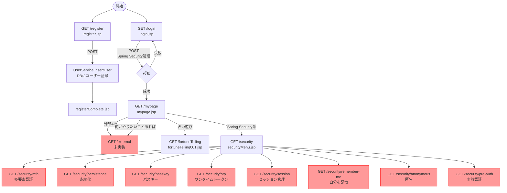

# プロジェクトフロー図

## 画面遷移フロー

> 赤色：未実装

---

## 未実装・未完成一覧

| 問題 | 場所 |
|------|------|
| `return new String()` で画面なし | ExternalController |
| JSP名typo `fortuneTellling001`（lが3つ） | FortuneTellingController |
| `@RequestParam String param` が必須になっているのにmypage.jspから渡していない | SecurityController |
| `/security/**` 各画面未作成 | security/配下のJSP |

---

## コントローラー対応表

| URL | メソッド | コントローラー | 遷移先 |
|-----|---------|--------------|--------|
| /login | GET | LoginController | login.jsp |
| /login | POST | Spring Security | /mypage |
| /register | GET | RegisterController | register.jsp |
| /register | POST | RegisterController | registerComplete.jsp |
| /mypage | GET | MyPageController | mypage.jsp |
| /security | GET | SecurityController | security/securityMenu.jsp |
| /external | GET | ExternalController | 未実装 |
| /fortuneTelling | GET | FortuneTellingController | fortuneTelling001.jsp |
| /weather | GET | ExternalController | 未実装 |
